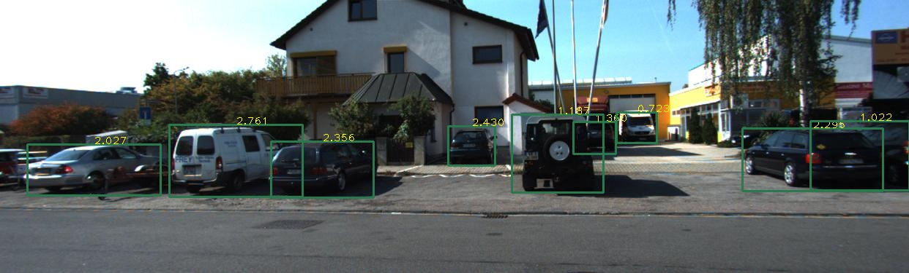

# DenseBox: A Fully Convolutional Neural Net Framework for Object Detection #

### Introduction ###

DenseBox is an unified framework for object detection with a single network. You can use the code to train/evaluate a network for object detection task. For more details, please refer to our [arXiv paper](http://arxiv.org/abs/1509.04874).

### Directory Explanation ###

* caffe_densebox: The caffe code for running densebox detection. This folder is similar to caffe, with only core cpp detection code added.
* experiment: All the matlab/python/linux shell scripts for running experiments. If you want a start, please refer to experiment/kitti.
* paper: latex files for writing the densebox paper.
